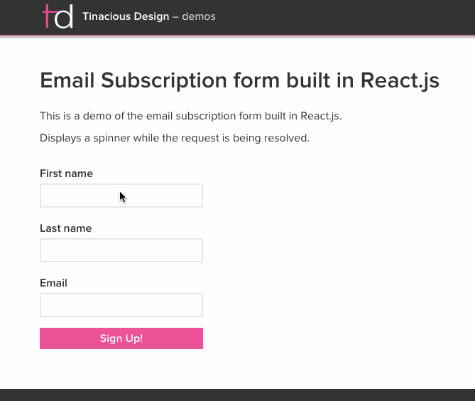

# Email Subscription form in React

This email subscription form makes a post request to a specified endpoint with the following properties as JSON data:

- `first_name`
- `last_name`
- `email`

This is the client-side for a complementary API that would make a request to the Mandrill API to subscribe the submitted user.

